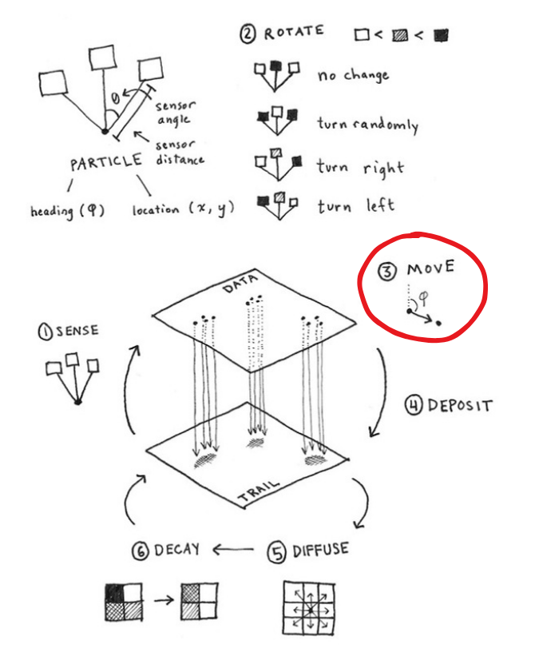

# Agents: Move

## Agent struct

```rust,noplayground
#[derive(Debug, Copy, Clone)]
struct Agent {
    /// Position
    position: [f32; 2],

    /// Velocity vector
    velocity: [f32; 2],
}
```

## Advance position by velocity vector

```wgsl
agent.position += agent.velocity;
```

## Model step


