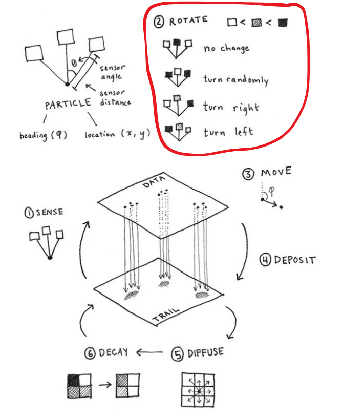

# Agents: Rotate

## Rotate the agent's velocity vector

```wgsl
if (sensor_cw_val > sensor_ahead_val && sensor_ahead_val > sensor_ccw_val) {
    // Turn clockwise
    agent.velocity = rotate_cw(45.0, agent.velocity);
}

if sensor_ccw_val > sensor_ahead_val && sensor_ahead_val > sensor_cw_val {
    // Turn counter-clockwise
    agent.velocity = rotate_ccw(45.0, agent.velocity);
}

if sensor_cw_val > sensor_ahead_val && sensor_ccw_val > sensor_ahead_val {
    // Rotate randomly left or right by RA.
    let ra = rand_sign(seed) * 45.0;
    agent.velocity = rotate_cw(ra, agent.velocity);
}
```

## Model step


