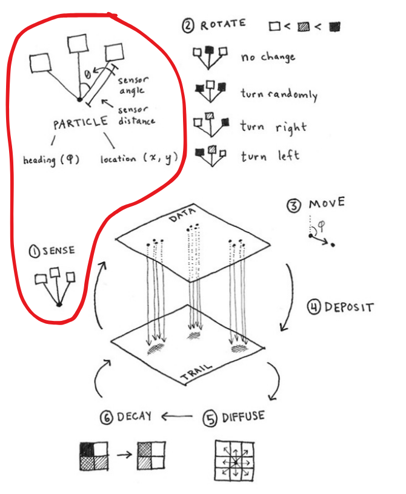

# Agents: Sense

- Sensor angle = 45°
- Sensor distance = 9 pixels

## Three sensors

```wgsl
let sensor_ahead_val: f32 = sense(agent, 0.0);
let sensor_ccw_val: f32 = sense(agent, 45.0);
let sensor_cw_val: f32 = sense(agent, -45.0);
```

## Sense function

```wgsl
fn sense(agent: Agent, sensor_angle_ccw_degrees: f32) -> f32 {
    // Normalized vector pointing straight ahead of the agent:
    let facing_direction = normalize(agent.velocity);

    // Rotate sensor
    let rotated_facing_direction: vec2<f32> = rotate_ccw(sensor_angle_ccw_degrees, facing_direction);

    // Target position of the sensor:
    let sensor_position: vec2<f32> = agent.position + rotated_facing_direction * 9.0;

    // Sample the trail map at the sensor_position
    return deposit_strength_at(sensor_position);
}
```

## Math utility methods

```wgsl
// Rotate clockwise, assuming a screen space coordinate system,
// ┌───➤ x
// │
// ▼
// y
fn rotate_cw(degrees: f32, v: vec2<f32>) -> vec2<f32> {
    let a = radians(degrees);
    return vec2(
        v.x * cos(a) - v.y * sin(a),
        v.x * sin(a) + v.y * cos(a)
    );
}

// Rotate counter-clockwise, assuming a screen space coordinate system,
// ┌───➤ x
// │
// ▼
// y
fn rotate_ccw(degrees: f32, v: vec2<f32>) -> vec2<f32> {
    return rotate_cw(-degrees, v);
}
```

## Model step


