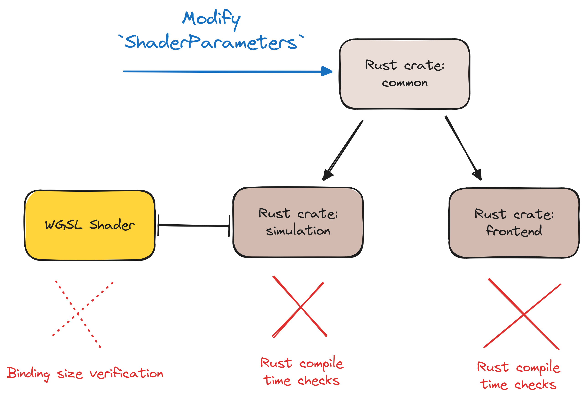

# Compile time guarantees 

## Add/Remove/Rename a field in `ShaderParameters`



### wgpu: Binding size verification

```diff
let bind_group_layout = device.create_bind_group_layout(&wgpu::BindGroupLayoutDescriptor {
    label: Some("Shader Context Bind Group Layout"),
    entries: &[wgpu::BindGroupLayoutEntry {
        binding: 0,
        visibility: wgpu::ShaderStages::COMPUTE | wgpu::ShaderStages::VERTEX_FRAGMENT,
        ty: wgpu::BindingType::Buffer {
            ty: wgpu::BufferBindingType::Uniform,
            has_dynamic_offset: false,
+           min_binding_size: wgpu::BufferSize::new(std::mem::size_of::<ShaderParameters>() as u64),
        },
        count: None,
    }],
});
```

- Not the same level of comfort as we are used to 👎
- Better than nothing 👍
