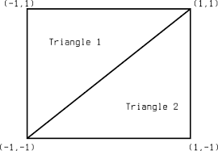

# Full Screen Quad: Implementation

## Two triangles cover the screen:



## Vertex Shader: 2 triangles x 3 corners = 6 vertices

### Rust

```rust,noplayground
let vertices = 0..6;
let instances = 0..1;
render_pass.draw(vertices, instances);
```

### GPU Vertex Shader

Output hardcoded vertices of 2 triangles:

```wgsl
@vertex
fn vertex_main(@builtin(vertex_index) vertex_index: u32) -> @builtin(position) vec4<f32> {
    var position: vec2<f32>;
    switch (vertex_index) {
        // Bottom left triangle
        case 0u: { position = vec2<f32>(-1.0, -1.0); }
        case 1u: { position = vec2<f32>(1.0, -1.0); }
        case 2u: { position = vec2<f32>(-1.0, 1.0); }

        // Top right triangle
        case 3u: { position = vec2<f32>(1.0, 1.0); }
        case 4u: { position = vec2<f32>(1.0, -1.0); }
        case 5u: { position = vec2<f32>(-1.0, 1.0); }

        default: { position = vec2<f32>(0.0, 0.0); } // This should never happen
    }

    let clip_position = vec4<f32>(position, 0.0, 1.0);
    return clip_position;
}
```

## Turn this thing on 

<http://127.0.0.1:8080/presentation/triangles>
