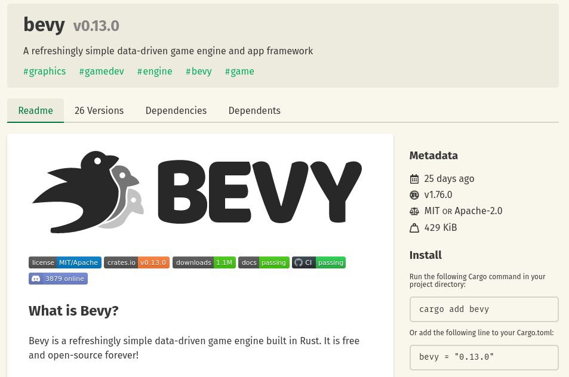
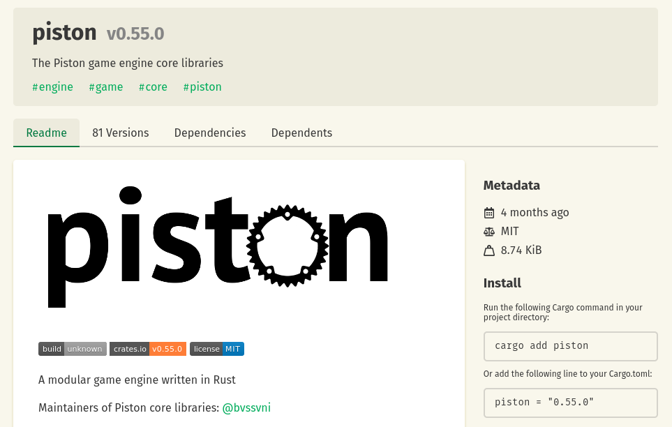
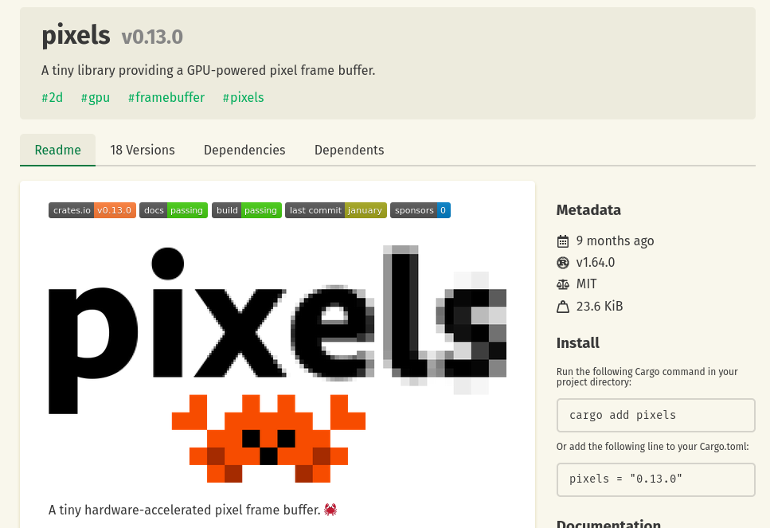
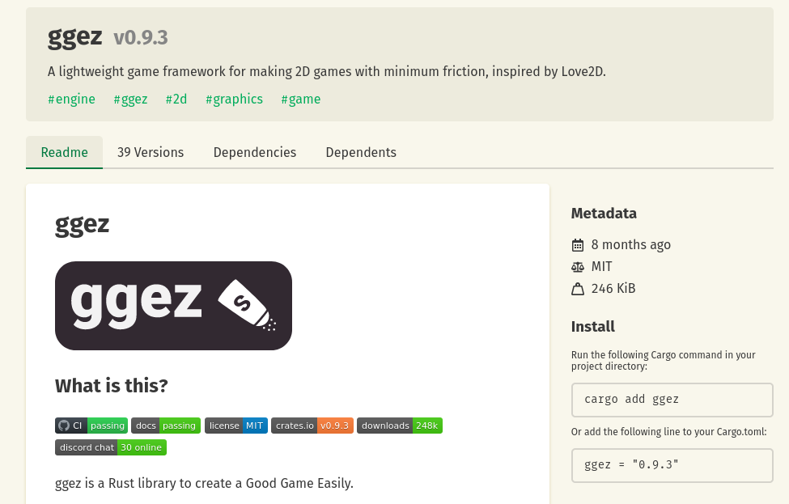
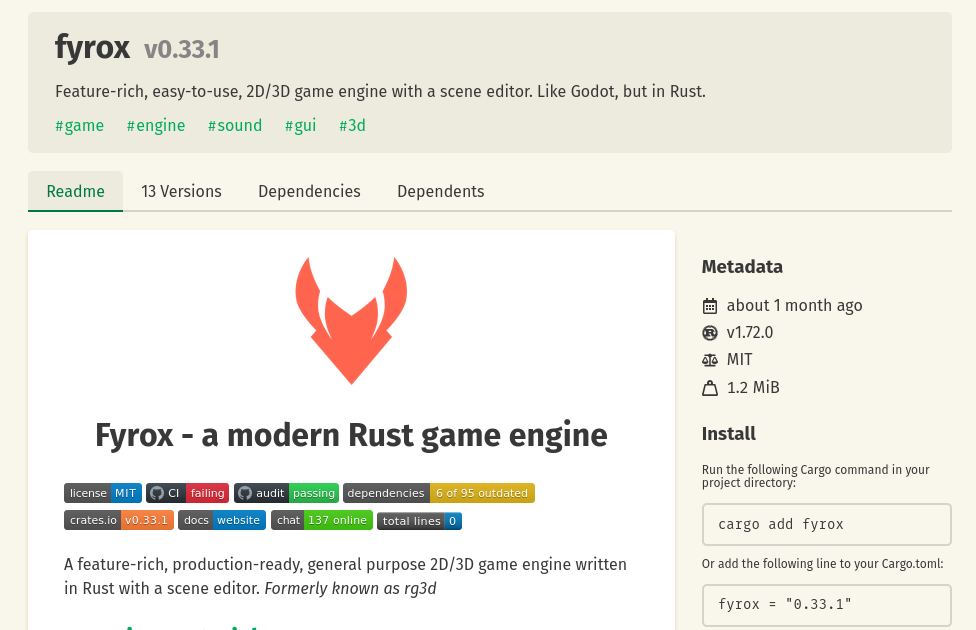

# Rust Game Engines

## Bevy



## Piston



## Pixels



## ggez



## Fyrox



## Under the hood

```
[ Bevy ]  [ Piston ]  [ Pixels ]  [ ggez ]  [ Fyrox ]
    |                    |          |
    |                    |          |
    +--------+-----------+----------+
                  |
               [ wgpu ]
```

## Up to date?

```
├── bevy v0.13.0
│   └── bevy_internal v0.13.0
│       └── bevy_a11y v0.13.0
│           └── bevy_app v0.13.0
│               └── wgpu v0.19.3
├── ggez v0.9.3
│   └── wgpu v0.16.3
└── pixels v0.13.0
    └── wgpu v0.16.3
```

# What is wgpu?

> wgpu is a safe and portable graphics library for Rust based on the WebGPU API

# What is WebGPU then?
