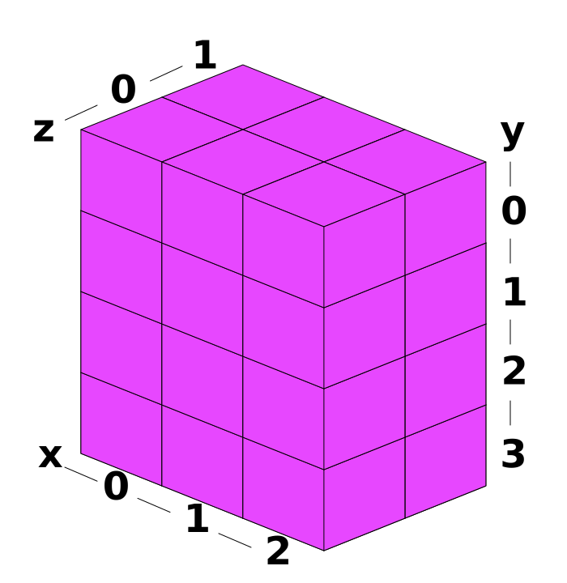
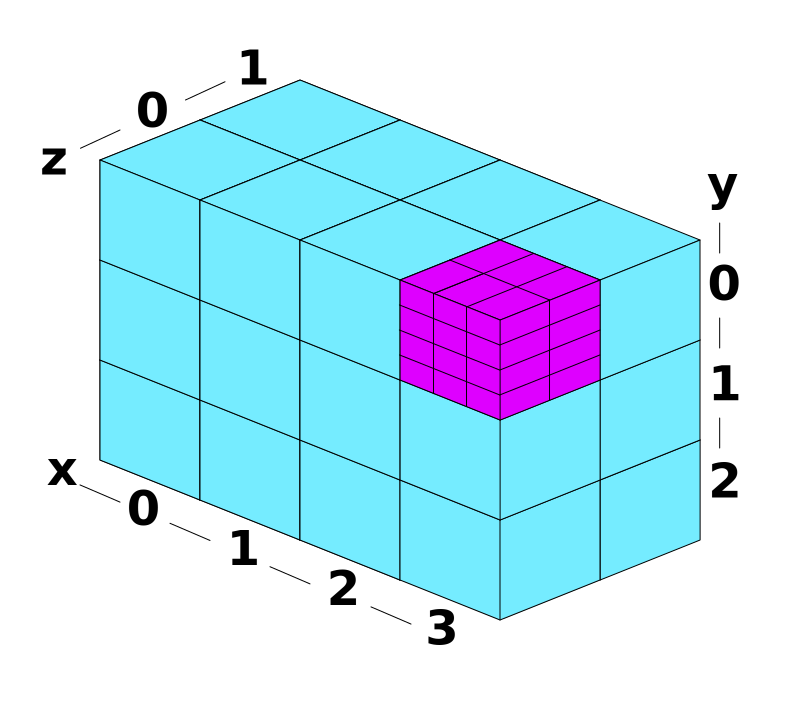

# Compute shader complexity

```diff
  @compute 
+ @workgroup_size(8,8,1) // 8x8x1 = 64 threads per workgroup
  fn compute_agents(
+     // ID of thread within the workgroup
+     @builtin(local_invocation_index) local_invocation_index: u32, 
+
+     // ID of _this_ workgroup out of all the dispatched workgroups
+     @builtin(workgroup_id) workgroup_id : vec3<u32>,              
+
+     // Number of workgroups dispatched in each dimension
+     @builtin(num_workgroups) num_workgroups: vec3<u32>,           
  ) {
```

- `workgroup_size` is specified in the WGSL shader
- `num_workgroups` is specified in the Rust code that dispatches work to the GPU

## GPU workgroup



Source: <https://webgpufundamentals.org/webgpu/lessons/webgpu-compute-shaders.html>

## GPU workgroup dispatch



Example: workgroup ID for shown workgroup is `(3,0,0)`

## Problem: We need the global index of the executing thread

### Can we cheat?

Say we want 80.000 agents!

- workgroup size x: 80.000
- workgroup size y: 1
- workgroup size z: 1
- workgroups dispatched x: 1
- workgroups dispatched y: 1
- workgroups dispatched z: 1

Easy:

```wgsl
let agent_idx = local_invocation_index;
```

### Problems

- These are `u16`, so max is 65536 
- Horrible for performance

### Proper solution - more boilerplate

```diff
  @compute 
  @workgroup_size(8,8,1)
  fn compute_agents(
      @builtin(local_invocation_index) local_invocation_index: u32,
      @builtin(workgroup_id) workgroup_id : vec3<u32>,
      @builtin(num_workgroups) num_workgroups: vec3<u32>,
  ) {
+     let num_threads_per_workgroup: u32 = 8u * 8u * 1u;
+     let workgroup_index =
+         workgroup_id.x +
+         workgroup_id.y * num_workgroups.x +
+         workgroup_id.z * num_workgroups.x * num_workgroups.y;
+     let global_invocation_index = workgroup_index * num_threads_per_workgroup + local_invocation_index;
+ 
+     let agent_idx = global_invocation_index;
+ 
+     // Handle overflow
+     if agent_idx >= ctx.number_of_active_agents {
+         return;
+     }
  
      var agent = agents_buffer[agent_idx];
  
      // Update the agent:
      // sense, rotate, move, deposit chemoattractant
  }
```
