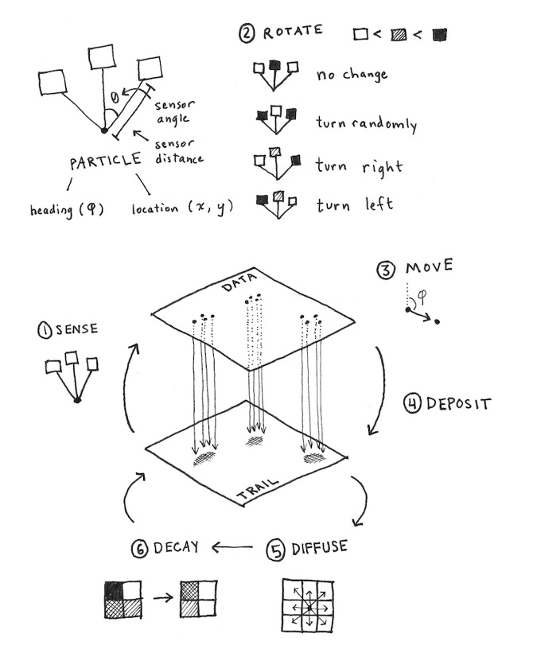

# Particle model

- _Illustration by Sage Jensen_: <https://cargocollective.com/sagejenson/physarum>

## Data structures

- Array of particles (agents), with
  - Position
  - Heading
- 2D trail map/texture of chemical trails
