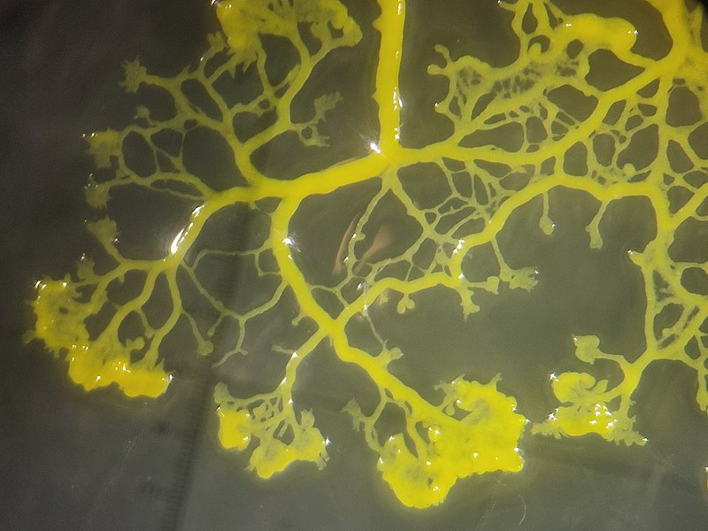

# Physarum Polycephalum

_Image attribution:_ <https://en.wikipedia.org/wiki/File:Physarum_polycephalum_strain_LU352_-_4.jpg>

## Wikipedia article, first sentence:

> Physarum polycephalum, an acellular slime mold or myxomycete popularly known as "the blob", (...)

### ... but an intelligent blob

> Studies on Physarum polycephalum have even shown the organism to have an ability to learn and predict periodic unfavorable conditions in laboratory experiments
>
> _Saigusa, Tetsu; Tero, Atsushi; Nakagaki, Toshiyuki; Kuramoto, Yoshiki (January 2008). "Amoebae anticipate periodic events"_

> They are "no more than a bag of amoebae encased in a thin slime sheath, yet they manage to have various behaviors that are equal to those of animals who possess muscles and nerves with ganglia – that is, simple brains."
>
> _John Bonner_
