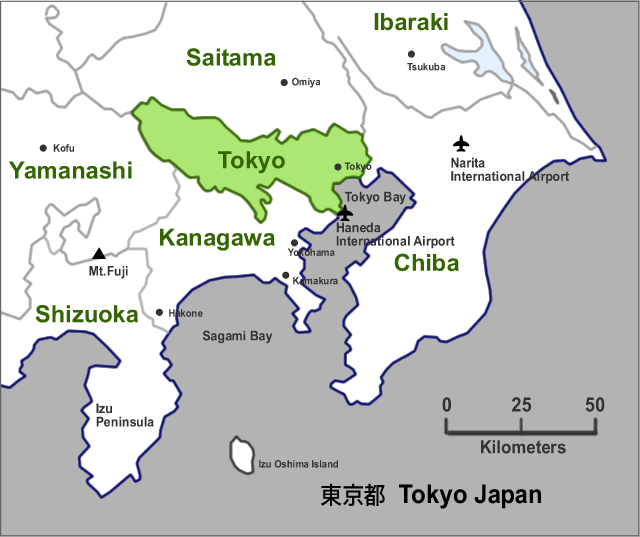
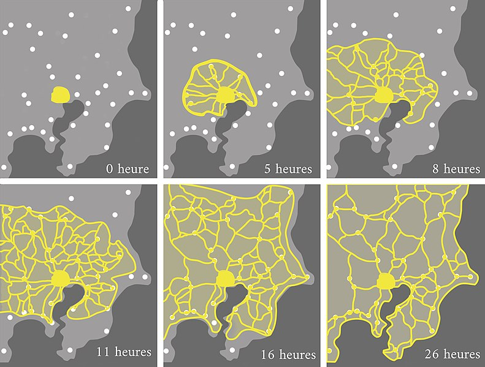

# Physarum Polycephalum Intelligence

## Tokyo Subway

Image attribution: <https://tokyo.digi-joho.com/maps-city-guides-tokyo.html>

Image attribution: <https://en.wikipedia.org/wiki/File:Physarum_polycephalum_network.jpg>

<video controls>
  <source src="./videos/Tokyo rail network designed by Physarum plasmodium [BZUQQmcR5-g].webm">
  Your browser does not support the video tag.
</video>

Video attribution: _Atsushi Tero, et al. Science 327, 439 (2010)_
