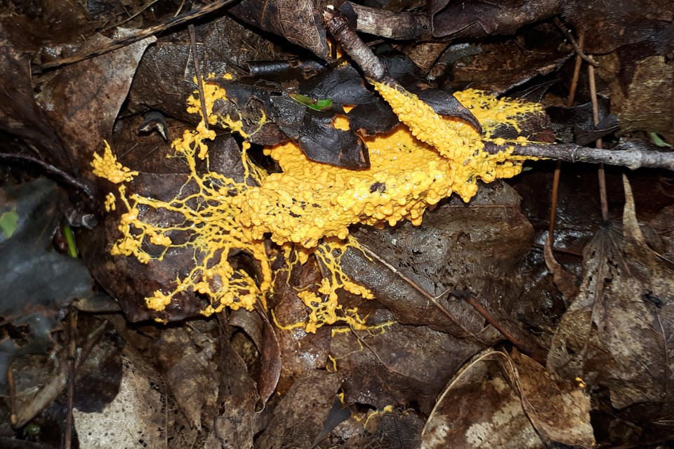
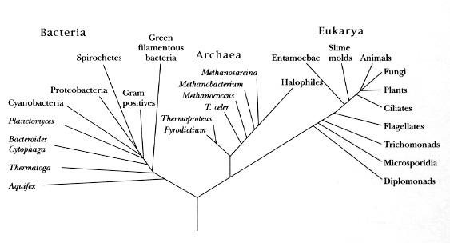
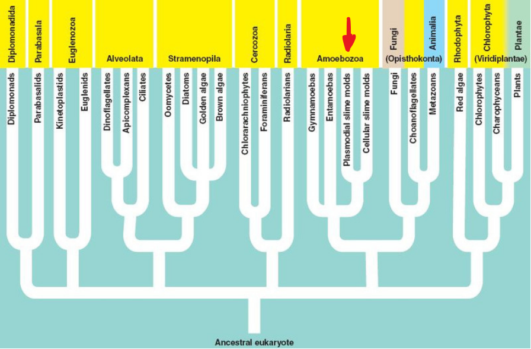

# Slime Molds

## Wikipedia:

> Slime mold is an informal name given to an assemblage of unrelated eukaryotic organisms

## Three forms of life

- **Bacteria** and **Archaea**: Single-celled organism, cells have no nuclei
- **Eukarya**: Cells have membrane-bound nuclei

_Image attribution:_ <http://bioweb.uwlax.edu/bio203/2010/renner_brad/classification.htm>
