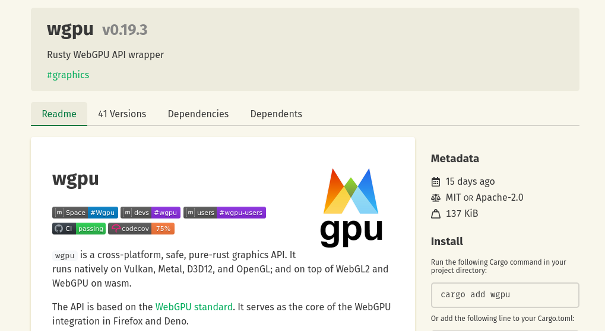

# wgpu



## wgpu - the glue between game engine and graphics hardware

`wpgu` acts as an abstraction layer at runtime, dynamically translating WebGPU API calls into the corresponding platform graphics APIs:

- Linux: Vulkan API
- MacOS: Metal API
- Windows: DirectX API
- Browser: WebGPU API - the browser then turns it into Vulkan, Metal, DirectX, ...
- or the appropriate commands for other graphics APIs on different platforms

```
    [ Bevy ]    [ Pixels ]    [ ggez ]
        |          |            |
        +----------+-----+------+
                         |
                      [ wgpu ]
                         |
       +-----------+-----+-----+-----------------------+
       |           |           |                       |
   [ Vulkan ]  [ Metal ]  [ DirectX ] ...  [ Browser WebGPU API ]
                                                       |
                                           +-----------+-----------+
                                           |           |           |
                                       [ Vulkan ]  [ Metal ]  [ DirectX ]
```
