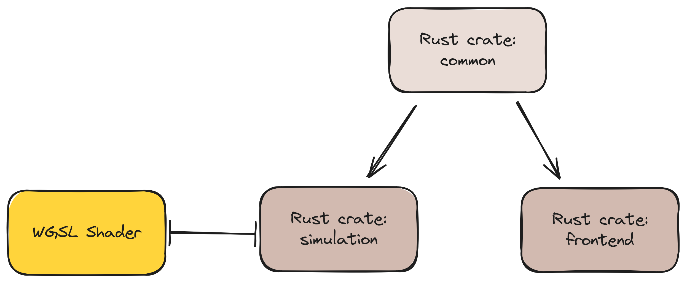

# Workspace



```
workspace
│
├── simulation
│   └── common (dependency)
│
├── frontend
│   └── common (dependency)
│
└── common
```

## DRY: Shader Parameters in `common`

- Rust struct 

```rust, noplayground
// ──────────────────────────────────────────────────
// In crate: common
// ──────────────────────────────────────────────────

#[derive(Debug, Clone, Copy, PartialEq, TypedBuilder)]
#[derive(Serialize, Deserialize)]
#[derive(bytemuck::Zeroable, derive(bytemuck::NoUninit)]
#[repr(C)]
pub struct ShaderParameters {
    /// Sensor distance (in pixels)
    #[builder(default = 9.0)]
    pub sensor_distance: f32,

    // etc...
}
```
